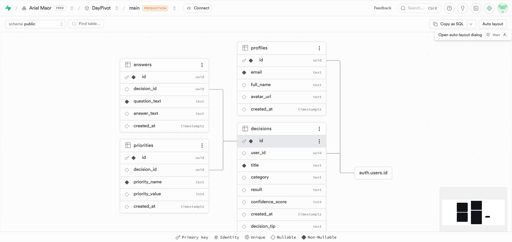

# DayPivot

Quick decision-making assistant — find clarity in every decision, today.

🔗 **Live app:** https://daypivot-app-arielmaor.vercel.app

## Overview
DayPivot is a mobile-first web app that helps people make small, everyday decisions quickly. Instead of managing tasks, users answer a short set of smart questions and get an instant, confidence-scored recommendation based on a built-in priority matrix.

## The Problem
People often hesitate over small decisions during the day — wasting time and mental energy weighing options, especially under time pressure. Most productivity apps focus on managing tasks, not on the actual moment of deciding.

## Who It's For
Anyone who hesitates over small, daily decisions — students juggling assignments, busy professionals making many choices a day, or simply people who feel mentally overloaded and want a quick way to think more clearly.

## Competitors & Differentiation
| Competitor | What it does | What's missing |
|---|---|---|
| Notion | Task & project management | No real-time decision support, just organizes existing tasks |
| Todoist | To-do lists | Manages tasks, doesn't help choose between options |
| Doing it manually / asking friends | The default today | Slow, inconsistent, no structured framework |

**DayPivot's differentiation:** it's not another task manager — it's built specifically around the *moment of deciding*, using guided smart questions and a priority matrix to produce an instant, scored recommendation.

## Tech Stack
- **Frontend:** React + Vite, React Router
- **Backend:** Supabase (PostgreSQL database + Auth)
- **Hosting:** Vercel

## External Services & Integrations
| Service | Type | Used for |
|---|---|---|
| Supabase Auth | Authentication | User sign up / login (email + password) |
| Supabase Postgres Database | Database | Storing profiles, decisions, answers, and priorities |

## Database (ERD)

Tables: `profiles`, `decisions`, `answers`, `priorities` — linked to Supabase's built-in `auth.users`.

## Main Pages
- `/` Login
- `/register` Register
- `/dashboard` Dashboard
- `/questions` Decision Questions flow
- `/result` Decision Result (saves to Supabase)
- `/history` Decision History (loaded from Supabase)
- `/profile` Profile
- `/settings` Settings
- `/forgot-password` Forgot Password

## Run Locally
npm install
npm run dev

Create a .env file in the project root with:
VITE_SUPABASE_URL=your_supabase_url
VITE_SUPABASE_ANON_KEY=your_supabase_anon_key

## Author
Ariel Maor — ID 325511442
